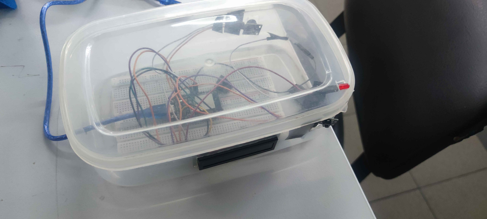
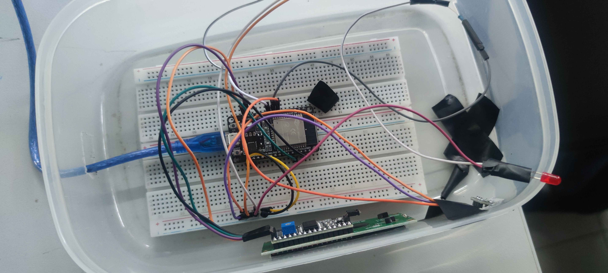

# ระบบกล่องยาอัจฉริยะ (Smart Medicine Reminder System)

โครงการนี้เป็นส่วนหนึ่งของวิชา ไมโครคอนโทรลเลอร์ ระดับชั้น ปวช.2
เพื่อสร้างระบบสมองกลฝังตัวที่สามารถแจ้งเตือนเมื่อถึงเวลารับประทานยา และช่วยป้องกันการลืมทานยา

---

## รายละเอียดโครงการ

ระบบจะใช้ไมโครคอนโทรลเลอร์ควบคุมการนับถอยหลังเวลา
เมื่อครบเวลาที่กำหนด ระบบจะ:

แสดงข้อความแจ้งเตือนบนจอ LCD

ส่งเสียงเตือนด้วย Buzzer

เปิดไฟ LED แจ้งเตือน

---

## รายการอุปกรณ์ (Hardware Components)
ลำดับ	รายการอุปกรณ์	จำนวน	หมายเหตุ
1	ESP32 / Arduino Uno	1	บอร์ดควบคุมหลัก
2	LCD I2C 16x2	1	แสดงผลเวลา
3	Buzzer	1	แจ้งเตือนเสียง
4	LED + ตัวต้านทาน 220Ω	1	ไฟแจ้งเตือน
5	Push Button	1	ปุ่มหยุดการแจ้งเตือน
6	Breadboard & Jumper	1	เชื่อมต่อวงจร
7	กล่องพลาสติก / เคส 3D	1	โครงสร้างกล่องยา

---

## รายการอุปกรณ์ (Hardware Components)
ลำดับ	รายการอุปกรณ์	จำนวน	หมายเหตุ
1	ESP32 / Arduino Uno	1	บอร์ดควบคุมหลัก
2	LCD I2C 16x2	1	แสดงผลเวลา
3	Buzzer	1	แจ้งเตือนเสียง
4	LED + ตัวต้านทาน 220Ω	1	ไฟแจ้งเตือน
5	Push Button	1	ปุ่มหยุดการแจ้งเตือน
6	Breadboard & Jumper	1	เชื่อมต่อวงจร
7	กล่องพลาสติก / เคส 3D	1	โครงสร้างกล่องยา

---

## การเชื่อมต่อวงจร (Pin Mapping)
1️⃣ การเชื่อมต่อ LCD I2C

VCC → 5V / VIN

GND → GND

SDA → GPIO 21

SCL → GPIO 22

2️⃣ การเชื่อมต่อ Buzzer

ขา + → GPIO 26

ขา - → GND

3️⃣ การเชื่อมต่อ LED

GPIO 25 → ตัวต้านทาน → ขายาว LED

ขาสั้น → GND

4️⃣ การเชื่อมต่อปุ่มกด

ขาหนึ่ง → GPIO 33

อีกขา → GND

ใช้ INPUT_PULLUP ภายใน

---

## ซอร์สโค้ด (Source Code)
/*
 Smart Medicine Box System
 ระบบแจ้งเตือนรับประทานยา
*/

#include <Wire.h>
#include <LiquidCrystal_I2C.h>

#define LED_PIN 25
#define BUZZER_PIN 26
#define BUTTON_PIN 33

LiquidCrystal_I2C lcd(0x27, 16, 2);

const int COUNTDOWN_TIME = 30; // ตั้งเวลาเตือน (วินาที)

unsigned long lastMillis;
int timeLeft;
bool alarming = false;

void setup() {
  pinMode(LED_PIN, OUTPUT);
  pinMode(BUTTON_PIN, INPUT_PULLUP);

  ledcAttach(BUZZER_PIN, 3000, 8);

  Wire.begin(21, 22);
  lcd.init();
  lcd.backlight();

  timeLeft = COUNTDOWN_TIME;
  lastMillis = millis();
}

void loop() {

  if (!alarming) {
    if (millis() - lastMillis >= 1000) {
      lastMillis = millis();
      timeLeft--;

      lcd.setCursor(0, 0);
      lcd.print("Medicine Timer");
      lcd.setCursor(0, 1);
      lcd.print("Time: ");
      lcd.print(timeLeft);
      lcd.print(" s   ");

      if (timeLeft <= 0) {
        alarming = true;
        digitalWrite(LED_PIN, HIGH);
        ledcWrite(BUZZER_PIN, 220);

        lcd.clear();
        lcd.print("Time to Take");
        lcd.setCursor(0,1);
        lcd.print("Your Medicine!");
      }
    }
  }

  if (alarming) {
    if (digitalRead(BUTTON_PIN) == LOW) {
      delay(50);
      if (digitalRead(BUTTON_PIN) == LOW) {
        ledcWrite(BUZZER_PIN, 0);
        digitalWrite(LED_PIN, LOW);
        alarming = false;
        timeLeft = COUNTDOWN_TIME;
        lcd.clear();
      }
    }
  }
}

---

    
## รูปถ่ายชิ้นงานจริง

คำอธิบาย: กล่องยาอัจฉริยะที่ติดตั้งจอ LCD ด้านหน้า พร้อมปุ่มควบคุม

คำอธิบาย: กล่องยาอัจฉริยะที่ติดตั้งจอ LCD ด้านหน้า พร้อมปุ่มควบคุม

    แผนผังวงจร

                +5V (VIN)
                  │
                  │
              ┌───────────┐
              │   LCD     │
              │  VCC  GND │
              │  SDA  SCL │
              └──┬────┬───┘
                 │    │
                 │    │
                21    22
             ┌─────────────────┐
             │      ESP32      │
             │                 │
             │  VIN ─────────────── +5V
             │  GND ─────────────── GND
             │  GPIO21 ──────────── SDA
             │  GPIO22 ──────────── SCL
             │  GPIO26 ────────┐
             │                 │
             │  GPIO25 ──R1──LED
             │                 │
             │  GPIO33 ──SW────┘
             └─────────────────┘
                        │
                        │
                       GND

## รายละเอียดสัญลักษณ์

แหล่งจ่ายไฟ

VIN = +5V

GND = กราวด์ร่วม

LCD I2C

VCC → +5V

GND → GND

SDA → GPIO21

SCL → GPIO22

Buzzer

ขา + → GPIO26

ขา - → GND

LED

GPIO25 → R1 (220Ω) → LED

LED อีกขา → GND

ปุ่มกด (SW)

ขาหนึ่ง → GPIO33

อีกขา → GND
(ใช้ Pull-up ภายใน)

## หลักการวงจร

ESP32 เป็นหน่วยควบคุมหลัก

LCD ใช้สื่อสารแบบ I2C (2 เส้นสัญญาณ)

LED และ Buzzer เป็นเอาต์พุตเตือน

ปุ่มกดเป็นอินพุตควบคุม

---

## ตารางตรวจสอบการทำงาน (Project Checklist)
สถานะ	รายการตรวจสอบ

✅	ตรวจสอบอุปกรณ์: เช็คสภาพสายไฟ บอร์ด และอุปกรณ์ครบถ้วน
✅	ต่อวงจรถูกต้องตามแผนผัง
✅	อัปโหลดโค้ดลงบอร์ดสำเร็จ
✅	ทดสอบครบเวลา ระบบแจ้งเตือนทำงานปกติ
✅	ทดสอบกดปุ่มหยุดเสียงเตือน
✅	ระบบรีเซ็ตและเริ่มนับเวลาใหม่ได้ถูกต้อง
✅	แสดงผลบนจอ LCD ถูกต้องครบถ้วน

---

## สมาชิกกลุ่ม (Group Members)
ลำดับ	ชื่อ-นามสกุล	           รหัสนักศึกษา	        หน้าที่
1	 [ปกป้อง ปทุมดำรงค์]	       [45981]	      เขียนโปรแกรม
2	 [ณัชญ์หิรัญ หิรัญประภาวิชญ์]     [46001]	       ต่อวงจร
3	 [สงกรานต์ กองซุย]                            ช่วยเตรียมของ
4    [ณัฎฐกิตติ์ ศุภโชคชลกุล]                       ช่วยเตรียมของ
5    [สุชานันท์ กายพันธุ์]                           ช่วยเตรียมของ

---

**แผนกวิชา:** เทคโนโลยีสารสนเทศ  
**ระดับชั้น:** ปวช. 2 กลุ่มที่ 6